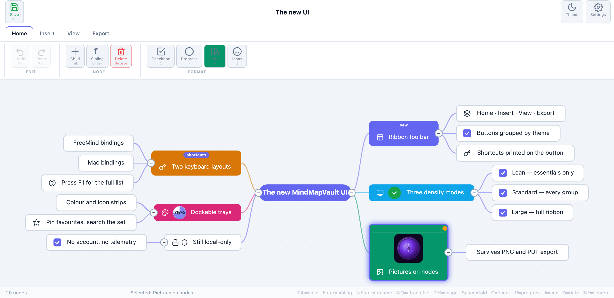

# MindMapVault FOSS

> **Quick download:** Prebuilt Windows and Linux desktop artifacts are published in the repository Releases section.

MindMapVault FOSS is a local-first, privacy-focused desktop mind-mapping application.

All core functionality works offline, all data stays on the device, and the repository contains no cloud code, no telemetry, and no external service dependencies.

## UI Preview

[](https://www.mindmapvault.com/)


## Demo

Interactive demo: https://mindmapvault.github.io/mindmapvault-foss/demo/

## Why This Project

MindMapVault FOSS exists as an auditable desktop implementation with a clear privacy posture.

What this repository provides:

- a React + TypeScript app for authoring and managing mind maps
- a Tauri desktop host for local filesystem integration
- encrypted local vault storage and local profile unlocking
- build and validation scripts suitable for contributors and reviewers

What this repository does not require for core use:

- a hosted backend
- an always-on internet connection
- an account registration flow

## Privacy Highlights

For reviewers (including privacy-list evaluators), the current posture is:

- local-first operation for create, edit, save, open, and export
- no mandatory remote service for core desktop usage
- encrypted-at-rest local vault artifacts
- open repository with inspectable implementation and documentation

Important boundary: this project is a privacy-focused desktop app, not an anonymity system. Endpoint compromise, weak passwords, and unsafe plaintext exports remain user-side risks.

## Architecture Overview

Core components:

1. frontend_app/ - React + TypeScript application and crypto layer
2. desktop/src-tauri/ - Rust desktop host, local storage and migration IO
3. local filesystem storage - per-profile app config/data directories

High-level flow:

1. User selects or creates a local profile.
2. Keys are derived locally from the user secret.
3. Vault metadata and map payloads are persisted as encrypted local artifacts.
4. Decryption occurs on-device while the session is unlocked.

Related technical notes:

- docs/LOCAL_STORAGE_AND_PROFILES.md
- docs/PROJECT_STRUCTURE_AND_BUILD.md

## Security Documentation

Read these together:

- SECURITY.md - technical security policy and threat model
- frontend_app/public/SECURITY.md - user-facing in-app security explainer

## Getting Started

One-command setup (Windows PowerShell):

```powershell
.\scripts\setup-desktop.ps1
```

One-command setup (Linux/macOS/WSL shell):

```bash
bash scripts/setup-desktop.sh
```

Optional modes:

```powershell
.\scripts\setup-desktop.ps1 -Mode dev
.\scripts\setup-desktop.ps1 -Mode build
```

```bash
bash scripts/setup-desktop.sh dev
bash scripts/setup-desktop.sh build
```

Prerequisites:

- Node.js 20+
- pnpm 10+
- Rust stable toolchain
- platform prerequisites required by Tauri

Check prerequisites in one go:

```powershell
node -v
pnpm -v
rustc -V
cargo -V
```

Install dependencies (recommended for first run):

```bash
pnpm --dir frontend_app install
```

Build frontend (sanity check):

```bash
pnpm --dir frontend_app build
```

Validate Tauri toolchain:

```bash
pnpm --dir frontend_app tauri info
```

Run desktop app (development):

```bash
pnpm --dir frontend_app tauri:dev
```

Build desktop artifacts:

```bash
pnpm --dir frontend_app tauri:build
```

macOS packaging output:

- `desktop/src-tauri/target/release/bundle/dmg/*.dmg` (host architecture only)

macOS notes:

- Requires macOS 10.15 or later. Apple Silicon (M1 and newer) is supported natively — no Rosetta needed.
- To produce a single DMG that runs on both Apple Silicon and Intel Macs, build a universal binary:

  ```bash
  rustup target add aarch64-apple-darwin x86_64-apple-darwin
  pnpm --dir frontend_app tauri:build --target universal-apple-darwin
  ```

  Output: `desktop/src-tauri/target/universal-apple-darwin/release/bundle/dmg/*.dmg`

- Released DMGs are not signed with an Apple Developer ID or notarized. On first launch macOS
  will block the app. Remove the quarantine flag after dragging it to Applications:

  ```bash
  xattr -dr com.apple.quarantine "/Applications/MindMapVault FOSS Local-Only.app"
  ```

Linux packaging output:

- `desktop/src-tauri/target/release/bundle/appimage/*.AppImage`

Linux notes:

- Requires the GTK/WebKit development headers on the build host:

  ```bash
  sudo apt-get install -y libwebkit2gtk-4.1-dev libgtk-3-dev \
    libayatana-appindicator3-dev librsvg2-dev patchelf
  ```

- **Tauri cannot cross-compile to Linux** from macOS or Windows — the build links
  against webkit2gtk and GTK, which only exist on Linux. To produce an AppImage
  from a non-Linux workstation, build inside a container (requires Docker or a
  compatible runtime):

  ```bash
  pnpm run build:linux
  ```

  This mirrors the `desktop-linux` CI job and writes the AppImage to `dist-linux/`.
  It targets `linux/amd64` to match the released artifacts; on Apple Silicon that
  runs under emulation, so expect it to be noticeably slower than a native build.

Windows setup notes for non-power users:

- Run commands from the repository root folder (the folder containing frontend_app and desktop).
- If install fails with EACCES in node_modules (often around fsevents on Windows), clean and reinstall:

```powershell
Remove-Item -Recurse -Force node_modules
pnpm --dir frontend_app install
```

- If pnpm warns that build scripts were ignored, run:

```powershell
pnpm approve-builds
```

Then retry the previous install/build command.

## Keyboard Shortcuts

The editor is keyboard-first and ships two closed layouts — pick one in
Settings → Interface, or let it default per platform (`FreeMind` on
Windows/Linux, `Mac` on macOS). `Mod` always resolves to your OS's own
modifier (⌘ on macOS, Ctrl elsewhere), regardless of which layout is active.
Press <kbd>F1</kbd> (FreeMind) / <kbd>⌘/</kbd> (Mac) in the editor for the
same table, grouped and always in sync with what will actually fire.

| Action | FreeMind (Windows/Linux) | Mac |
|---|---|---|
| **Nodes** | | |
| Add child | Tab / Insert | Tab |
| Add left child (root) | Shift+Tab | ⇧Tab |
| Add sibling | Enter | Enter |
| Delete node | Delete / Backspace | Delete / Backspace |
| Rename | F2 | ⌘Enter |
| Notes | F3 | ⌘⇧K |
| Edit notes | Ctrl+E | ⌘E |
| Add image | Alt+K | ⌥K |
| Attach encrypted file | F6 | ⌘O |
| Fold / Unfold | Space | Space |
| Reset position | R | R |
| Reset all positions | Ctrl+Shift+R | ⌘⇧R |
| Auto-align subtree | A | A |
| **Format** | | |
| Colour picker | F4 | B |
| Icons | I | I |
| Checkbox | C | C |
| Progress | P | P |
| Dates | D | D |
| URL | U | U |
| Labels | T | T |
| **View** | | |
| Go to root | Home | H |
| Focus mode | F5 / F | ⌘⇧F |
| Zoom in | + | + |
| Zoom out | - | - |
| Toggle colour tray | Ctrl+Shift+1 | ⌘⇧1 |
| Toggle icon tray | Ctrl+Shift+2 | ⌘⇧2 |
| **Edit** | | |
| Undo | F9 / Ctrl+Z | ⌘Z |
| Redo | F10 / Ctrl+Y / Ctrl+Shift+Z | ⌘⇧Z |
| **Find** | | |
| Search | Ctrl+F | ⌘F |
| Shortcuts (this table) | F1 | ⌘/ |
| **File** | | |
| Save | Ctrl+S | ⌘S |

Source of truth: `frontend_app/src/shortcuts/registry.ts` — each layout is
an exhaustive, closed set (nothing falls back to the other layout's keys).
The desktop app's native menu bar mirrors the subset of these with an
unambiguous, modifier-based binding; bare-letter shortcuts (`B`, `H`, `R`,
`A`, `C`, `P`, `D`, `U`, `T`, `Space`, `Tab`, `Enter`, `+`/`-`) are
click-only there so an OS-level accelerator can't steal that character
while you're typing in a text field.

## Validation

Repository checks:

```bash
node scripts/version-check.js
node scripts/check_foss_saas_residue.mjs
node scripts/check_frontend_offline_parity.mjs
```

Workflow-style checks on Windows:

```powershell
.\scripts\test-workflow.ps1
```

Workflow-style checks on Linux/WSL/macOS:

```bash
./scripts/test-workflow.sh
```

## Release Outputs

Typical outputs include:

- Windows executable/installer bundles
- Linux AppImage artifacts (when host packaging dependencies are available)

Build workflow configuration lives in .github/workflows/desktop-build.yml.


## Contributing

Please read:

- CONTRIBUTING.md
- CHANGELOG.md
- CREDITS.md

Contribution expectations:

- keep changes focused and reviewable
- preserve local-first privacy guarantees
- avoid hidden telemetry and avoid leaking sensitive data to logs
- document user-visible and security-relevant changes clearly

## License

MindMapVault FOSS is released under the MIT license. See LICENSE for details.
